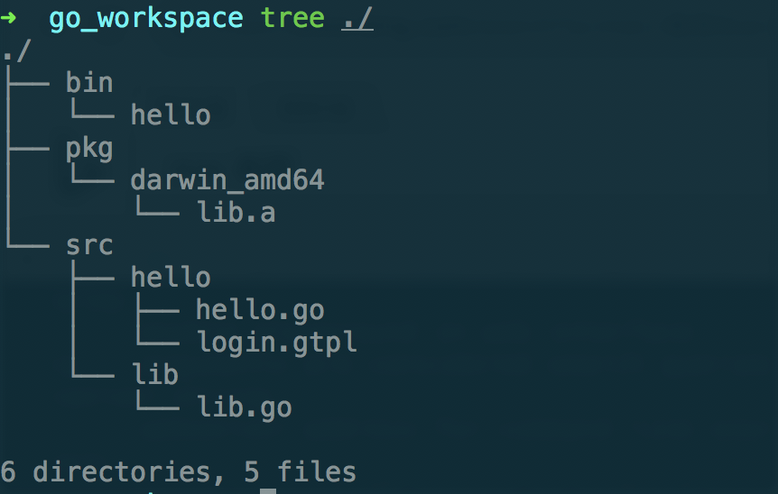

## Algorithm
### [ThreeSum](https://leetcode.com/problems/3sum/description/)
这个题目的要求是要找出一个数组中所有三个数字和为0的组合，且各个组合中的数字不能相同，即[1, 0, -1]与[0, 1, -1]只能算一个组合。刚开始的做法是用一个三重循环来暴力求解，然后用```std::set```来判断是否有重复的组合(std::set默认会对元素排序)。但是提交的时候会超时。看了一个用c++的解答答案，这个答案比较的巧妙，并且其中的一些想法是值得借鉴的，因此记录下来。
``` c++
class Solution
{
public:
    std::vector<std::vector<int>> threeSum(std::vector<int>& nums) 
    {
        std::vector<std::vector<int>> results;
        std::sort(nums.begin(), nums.end());
        for(auto i = 0; i < nums.size(); ++i)
        {
            int target = -nums[i];
            int front = i + 1;
            int back = nums.size() - 1;
            while(front < back)
            {
                if(nums[front] + nums[back] < target)
                {
                    front++;
                }
                else if(nums[front] + nums[back] > target)
                {
                    back--;
                }
                else
                {
                    std::vector<int> vec;
                    vec.push_back(nums[i]);
                    vec.push_back(nums[front]);
                    vec.push_back(nums[back]);
                    results.push_back(vec);
                    
                    while(front < back && nums[front] == vec[1])
                    {
                        front++;
                    }
                    while(front < back && nums[back] == vec[2])
                    {
                        back--;
                    }
                }
            }
            while(i < nums.size() && nums[i] == nums[i + 1])
            {
                i++;
            }
        }
        return results;
    }
};
```
在这个解答中，首先对输入数组排序，然后针对数组的每个元素，选择后续的两个元素的组合满足和为零的条件。这里通过两者和的值与目标值的大小移动数组的front和back下标。然后通过三个while循环来移除重复的可能性。

## Review
### [Understanding Compilers — For Humans ](https://towardsdatascience.com/understanding-compilers-for-humans-version-2-157f0edb02dd)
这篇文章介绍了编译器的原理，即如何由源程序生成最终可执行的程序。总结起来经历了如下几个步骤：
1. 词法分析（Lexical Analysis）：将源文件中的字符分析成单词，标识符，符号等。
2. 解析(Parsing): 将词法分析生成的各种标识符，单词等符号解析成各种表达式，比如函数调用，数学表达式。最后生成一个Abstract Synatax Tree.
3. 代码生成:由上述的抽象语法树生成汇编代码，并由汇编代码生成二进制的机器码组成的结果。
4. 二进制的机器码文件并不能直接执行，一般会通过链接步骤才能生成可执行程序。
这个文档中有许多的链接，这些链接对于了解整个编译步骤有很大的用处。

## Tech
### GOPATH作用
go语言编程中，安装好语言包后，第一步通常是设置开发环境变量GOROOT, GOPATH， GOBIN，其中GOPATH是最重要的一个变量，充分理解GOPATH变量的含义及其相关命令对go语言的工程组织，开发过程都有较重要的作用，因此这里记录下GOPATH及其相关命令。
1. GOPATH概念</br>
GOPATH是一个环境变量，其中由多个目录路径构成，每个路径表示一个工作区，其中包含了go源码、命令文件、库，所有开发测试都是在工作区内进行。
2. GO源码的组织方式</br>
go语言以包的形式组织，语言包与目录结构对应。通常GOPATH/src 保存工程的源码文件，src内部下可以嵌套各个语言包.如下图所示：

如图所示src/hello为main包，lib为一个用户编写的库，通过go install ./src.hello，可以生成bin及pkg两个文件夹。其中bin为保存的命令文件，pkg中保存的为库文件。darwin_amd64表示目标平台。
3. 构建及安装</br>
go build进行构建，go install进行安装。安装命令先执行构建，然后进行链接与安装操作。go install 安装命令如果针对库源码，则会生成pkg内的库，若针对的是命令源码文件，则生成的是命令文件及需要的库文件。go build更多的是针对某一部分库或文件进行正确性验证，检查其中的错误。
## Share
### 高并发的常见两种模式之一：Reactor
#### Reactor模式
1. 概念: Reactor模式是一种基于事件处理的高并发模式。其可以同时出来多个来自客户端的请求，请求由多路分发器转发至处理程序完成处理，分发过程是同步完成的。
2. Reactor的组成部分：
    1. 事件源：发起各种读写请求的事件来源。
    2. 同步事件分发器：将各种事件源的请求发送至处理函数，不同于阻塞式的读写，事件分发器基于事件进行触发，当事件源能够进行读写时才会进行操作，不会引起阻塞动作，有效减少了IO等待的时间。
    3. 分发器：完成处理函数的注册和注销功能，同时根据不同的事件源，选择对应的处理函数完成服务。
    4. 请求处理者：实际完成请求服务处理的程序。
3. Reactor的优点：
    1. 由于Reactor的结构，各个组成可以形成复用性较好的模块。
    2. 相比于阻塞式的服务器读写操作，Reactor不会在IO上阻塞，可以提高系统的利用率。
    3. 服务处理流程是同步操作，允许多线程完成功能，并且线程间的同步也比较简单。
4. Reactor的缺点：
    1. 由于流程被分割成了独立的处理流程，因此增加了调试的难度。
    2. 由于处理流程是同步调用，采用多线程的模式会造成并发数量受限。